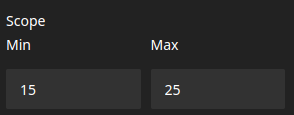

# Scope editor for Neos CMS
Neos package for adding scope editor that consist of two dependant fields which allows user to select scope

## Introduction
This package adds scope editor with two dependant numerical fields. Each field have possibility to have dedicated setting of minimum, maximum and step.
Package is dedicated for use in Neos CMS UI.


## Example



## Installation

    composer require --no-update skw/neos-scopeeditor

Then run `composer update` in your project directory.


## Configuration
Example configuration preview.

```YAML
  ...
  properties:
    scope:
      type: array
      ui:
        label: i18n
        reloadIfChanged: true
        inspector:
          group: 'document'
          editor: 'Skw.Neos.ScopeEditor/ScopeEditor'
          editorOptions:
            lower: # single field settings ( override if needed )  
              initial: 0 
              min: 15
              max: 50
              step: 5
            higher: # single field settings ( override if needed ) 
              initial: 0
              min: 15
              max: 50
              step: 5
            initial: 0 # fields settings ( can be overrided in single fields)
            min: 0
            max: 100
            step: 5
```
